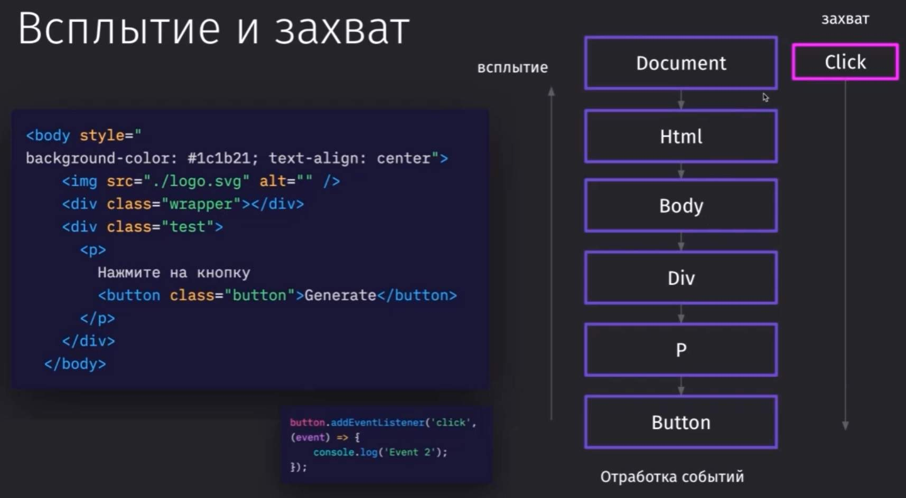

**Всплытие событий** (event bubbling) — это механизм в **DOM API**, при котором событие, произошедшее на элементе, сначала обрабатывается на этом элементе (целевом), а затем последовательно передаётся (всплывает) вверх по иерархии DOM к его родительским элементам, вплоть до корня документа (`document`) или окна (`window`). 

Это ключевая особенность событийной модели в браузерах, которая позволяет эффективно обрабатывать события, особенно с использованием **делегирования событий**.

---

### 1. Как работает всплытие событий?

Когда событие (например, `click`, `mouseover`, `keydown`) происходит на элементе, оно проходит через три фазы:

1. **Фаза захвата (Capturing Phase)**:
   - Событие начинается с корня документа (`document`) и движется вниз по дереву DOM к целевому элементу (тому, на котором произошло событие).
   - По умолчанию обработчики не срабатывают на этой фазе, если не указано явно (через параметр `capture` в `addEventListener`).

2. **Фаза цели (Target Phase)**:
   - Событие достигает целевого элемента, на котором оно изначально произошло.
   - Обработчики, привязанные к этому элементу, срабатывают.

3. **Фаза всплытия (Bubbling Phase)**:
   - После обработки на целевом элементе событие начинает "всплывать" вверх по иерархии DOM, вызывая обработчики на родительских элементах, вплоть до `document` и `window`.
   - Большинство событий в DOM по умолчанию всплывают (например, `click`, `mouseover`), но некоторые (например, `focus`, `blur`) не всплывают.

**Пример структуры DOM**:

```html
<div id="parent">
  <button id="child">Кликни меня</button>
</div>
```

Если пользователь кликает на `<button>`, событие `click` сначала обрабатывается на `<button>` (фаза цели), а затем всплывает к `<div>`, `<body>`, `html`, `document` и `window`, см. ниже: 



---

### 2. Пример всплытия событий:

Рассмотрим HTML и JavaScript код, демонстрирующий всплытие:

```html
<div id="parent">
  <button id="child">Кликни меня</button>
</div>
<script>
  const parent = document.querySelector('#parent');
  const child = document.querySelector('#child');

  child.addEventListener('click', () => {
    console.log('Клик на кнопке (child)');
  });

  parent.addEventListener('click', () => {
    console.log('Клик на родителе (parent)');
  });

  document.addEventListener('click', () => {
    console.log('Клик на document');
  });
</script>
```

**Результат при клике на кнопку**:
```
Клик на кнопке (child)
Клик на родителе (parent)
Клик на document
```

**Объяснение**:
- Клик происходит на `<button>` (цель).
- Сначала срабатывает обработчик на `<button>`.
- Затем событие всплывает к `<div>` и вызывает его обработчик.
- Наконец, событие доходит до `document` и вызывает его обработчик.

---

### 3. Управление всплытием событий:

#### 3.1. Остановка всплытия (`event.stopPropagation`)
- Метод `event.stopPropagation()` предотвращает дальнейшее всплытие события вверх по дереву DOM. Это полезно, если нужно ограничить обработку события только целевым элементом или его ближайшими родителями.
- **Примечание**: Этот метод не останавливает обработку других обработчиков на том же элементе.

**Пример**:

```javascript
child.addEventListener('click', (event) => {
  console.log('Клик на кнопке');
  event.stopPropagation(); // Останавливаем всплытие
});

parent.addEventListener('click', () => {
  console.log('Клик на родителе'); // Не сработает
});
```

**Результат при клике на кнопку**:
```
Клик на кнопке
```

#### 3.2. Остановка немедленного всплытия (`event.stopImmediatePropagation`)
- Метод `event.stopImmediatePropagation()` не только останавливает всплытие, но и предотвращает выполнение других обработчиков на том же элементе.
- **Применение**: Когда несколько обработчиков привязаны к одному элементу, и нужно прервать их выполнение.

**Пример**:

```javascript
child.addEventListener('click', () => {
  console.log('Обработчик 1');
  event.stopImmediatePropagation();
});

child.addEventListener('click', () => {
  console.log('Обработчик 2'); // Не сработает
});
```

**Результат**:
```
Обработчик 1
```

#### 3.3. Работа с фазой захвата:

- По умолчанию `addEventListener` работает на фазе всплытия. Чтобы обработчик срабатывал на фазе захвата, используйте параметр `{ capture: true }`.

**Пример**:

```javascript
parent.addEventListener(
  'click',
  () => {
    console.log('Родитель (фаза захвата)');
  },
  { capture: true }
);

child.addEventListener('click', () => {
  console.log('Кнопка (фаза цели)');
});

parent.addEventListener('click', () => {
  console.log('Родитель (фаза всплытия)');
});
```

**Результат при клике на кнопку**:
```
Родитель (фаза захвата)
Кнопка (фаза цели)
Родитель (фаза всплытия)
```

---

### 4. Делегирование событий:

Всплытие событий лежит в основе **делегирования событий** — техники, при которой обработчик назначается на родительский элемент, а не на каждый дочерний. Это позволяет обрабатывать события для динамически добавленных элементов и экономить ресурсы.

**Пример делегирования**:

```html
<ul id="list">
  <li>Элемент 1</li>
  <li>Элемент 2</li>
</ul>
<script>
  const list = document.querySelector('#list');
  list.addEventListener('click', (event) => {
    if (event.target.tagName === 'LI') {
      console.log(`Клик на: ${event.target.textContent}`);
    }
  });

  // Динамически добавляем новый элемент
  const newItem = document.createElement('li');
  newItem.textContent = 'Элемент 3';
  list.appendChild(newItem); // Обработчик всё равно сработает
</script>
```

**Преимущества делегирования**:
- Экономия памяти: один обработчик вместо множества.
- Поддержка динамически добавленных элементов.
- Упрощение кода при работе с большим количеством элементов.

---

### 5. События, которые не всплывают:

Некоторые события **не поддерживают всплытие** по умолчанию:
- `focus`, `blur`: События фокуса.
- `mouseenter`, `mouseleave`: События мыши, связанные с наведением (в отличие от `mouseover`/`mouseout`).
- `load`, `unload`: События загрузки страницы.
- `scroll`: Прокрутка (хотя в некоторых случаях может быть перехвачено через делегирование).

Для обработки таких событий в родительских элементах можно использовать фазу захвата или специальные API (например, `focusin`/`focusout` вместо `focus`/`blur`, так как они всплывают).

**Пример для focusin**:

```javascript
parent.addEventListener('focusin', (event) => {
  console.log('Фокус на элементе:', event.target);
});
```

---

### 6. Особенности всплытия событий:

1. **Производительность**:
   - Всплытие позволяет оптимизировать обработку событий через делегирование, но чрезмерное количество обработчиков на родительских элементах может замедлить приложение.
   - Используйте `event.stopPropagation()` с осторожностью, чтобы не нарушить логику других обработчиков.

2. **Кроссбраузерность**:
   - Всплытие поддерживается всеми современными браузерами, но старые версии (например, IE8) могут иметь ограничения в обработке событий.
   - Для кроссбраузерной совместимости используйте стандартные события и проверяйте поддержку через **Can I Use** (https://caniuse.com).

3. **Объект события**:
   - Объект `event` содержит информацию о целевом элементе (`event.target`), текущем элементе (`event.currentTarget`) и фазе события (`event.eventPhase`).
     - `eventPhase`:
       - `1`: Фаза захвата.
       - `2`: Фаза цели.
       - `3`: Фаза всплытия.

**Пример проверки фазы**:

```javascript
parent.addEventListener(
  'click',
  (event) => {
    console.log(`Фаза: ${event.eventPhase}`); // 1 (захват) или 3 (всплытие)
  },
  { capture: true }
);
```

4. **Предотвращение стандартного поведения**:
   - Всплытие не влияет на стандартное поведение браузера (например, переход по ссылке). Для его отмены используйте `event.preventDefault()`.

**Пример**:

```javascript
document.querySelector('a').addEventListener('click', (event) => {
  event.preventDefault();
  console.log('Переход по ссылке отменён');
});
```

---

### 7. Практический пример:

Допустим, у нас есть список, и мы хотим обрабатывать клики по элементам с возможностью остановки всплытия:

```html
<div id="container">
  <ul id="list">
    <li class="item">Элемент 1</li>
    <li class="item">Элемент 2</li>
  </ul>
</div>
<script>
  const container = document.querySelector('#container');
  const list = document.querySelector('#list');

  // Обработчик на контейнере (фаза захвата)
  container.addEventListener(
    'click',
    () => {
      console.log('Клик на контейнере (захват)');
    },
    { capture: true }
  );

  // Делегирование на списке
  list.addEventListener('click', (event) => {
    if (event.target.classList.contains('item')) {
      console.log(`Клик на: ${event.target.textContent}`);
      event.stopPropagation(); // Останавливаем всплытие
    }
  });

  // Обработчик на контейнере (фаза всплытия)
  container.addEventListener('click', () => {
    console.log('Клик на контейнере (всплытие)'); // Не сработает из-за stopPropagation
  });
</script>
```

**Результат при клике на "Элемент 1"**:
```
Клик на контейнере (захват)
Клик на: Элемент 1
```

---

### Итог:

Всплытие событий — это фундаментальный механизм DOM API, который позволяет событиям распространяться от целевого элемента к его родителям. Это делает возможным делегирование событий, упрощает обработку динамических элементов и экономит ресурсы. 

Ключевые методы управления всплытием — `event.stopPropagation` и `event.stopImmediatePropagation`, а для работы с фазой захвата используется параметр `{ capture: true }` в `addEventListener`. Понимание всплытия важно для создания эффективных и масштабируемых веб-приложений.